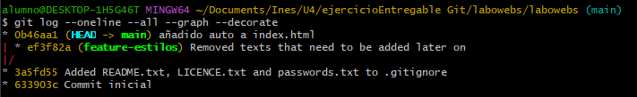
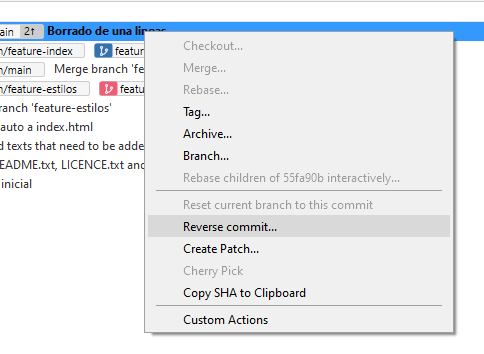

> Álvaro Ronco Acebal

# Ejercicios de Git - labowebs

[TOC]

<div style="page-break-after: always"></div>

## Trabajo en local

1. **Inicializa un nuevo repositorio Git en una carpeta llamada  ``"labowebs"`` y agrega los  archivos proporcionados en el aula virtual. Renombra la rama master a  ``main``, si es  necesario. Realiza el primer commit. Muestra el log del repositorio.**

   ```bash
   $ git init
   $ git branch -m master main
   $ git add .
   $ git commit -m "Commit Inicial"
   $ git log --oneline --all --graph --decorate
   ```

   

2. **Incluye un fichero  ``.gitignore`` para que  los ficheros  ``README.md``,  ``LICENCE.txt`` y  ``passwords.txt`` sean ignorados por el control de versiones. Realiza el commit y muestra  los logs del repositorio en una línea.**

   Usando visual studio code escribo lo siguiente dentro del ``.gitignore`` recién creado. 

   

   ```bash
   $ git add .gitignore
   $ git commit -m ""
   $ git log --oneline --all --graph --decorate
   ```

   

3. **En el repositorio, crea los archivos ``README.md``,  ``LICENCE.txt`` y  ``passwords.txt`` con  algún contenido. Muestra el estado del repositorio. Muestra el listado de archivos  ignorados.**

   ```bash
   $ git status
   ```

   

   ```bash
   $ git ls-file --ignored --exclude-standard -o
   ```

   

4. **Crea una rama  ``feature-estilos``. Cámbiate a ella.**  

   ```bash
   $ git checkout -b feature-estilos main
   ```

   

   - **Modifica el archivo  estilos.css:**
     - **propiedad color del  ``body`` y de  propiedad  ``h2``:  ``#2a2a2a``** 
     - **``background-color`` de  ``header`` y  ``footer``: ``#2a75ff``**

   ```bash
   $ git add css/estilos.css
   $ git commit -m "cambiados estilos"
   ```

   

   

   Usando el editor visual studio code cambie los colores a otros.

   

   

5. **Vuelve a la rama  ``main``. En el archivo  ``index.html`` añade un comentario donde se indique  tu nombre como autor de la página. Comprueba el estado del repositorio. Añade los  cambios, realiza un commit con el mensaje 'añadido autor en index'. Muestra los logs del  repositorio en una línea, gráficamente y con 'decoración'.**

   ```bash
   $ git checkout main
   ```

   

   ```bash
   $ git status
   ```

   

   ```bash
   $ git add index.html
   $ git commit -m "añadido autor en index"
   ```

   

   ```bash
   $ git log --oneline --all --graph --decorate
   ```

   

6. **Fusiona la rama  ``feature-estilos`` en la rama  ``main`` . Muestra los logs del repositorio en  una línea, gráficamente y con 'decoración'.**

   ```bash
   $ git checkout main
   $ git merge feature-estilos
   ```

   

   ```bash
   $ git log --oneline --all --graph --decorate
   ```

   

<div style="page-break-after: always"></div>

## Trabajo en remoto

1. **Continúa con el repositorio  ``labowebs``.  Añade el repositorio a Sourcetree.**

   

2. **Crea un repositorio remoto y sube al remoto los ficheros de tu repositorio local. Debes  subir todas las ramas.**

   He creado un repositorio publico en git.

   

   ```bash
   $ git remote add origin https://github.com/alvarora62/despliegue24gitEntregable.git
   $ git branch -M main
   $ git push -u origin main
   ```

   En Source Tree:

   1º. Hacemos click sobre "Remote" y en el pop-up que nos muestra en "Settings".

   

   2º.En la nueva ventana que sale le damos a "add".

   

   3º.Le ponemos un nombre al remoto, el que se quiera, en mi caso lo llame "origin", y el enlace del repositorio. Más abajo ponemos el nombre de usuario de git, en mi caso "alvarora62". Una vez rellenado esto, le damos a "OK".

   

   4º.Una vez añadido el remoto le damos a "OK".

   

   5º.Ahora vamos a hacer el primer push hacia el repositorio, vamos a la barra lateral izquiera, click derecho sobre "main" --> "push to" --> "origin"(o el nombre que se le haya puesto al remoto)

   

   6º.En mi caso quiero subir ambas ramas, asi que marco todas las casillas. Termino dandole a "push".

   

   7º.Ahora ya lo tengo subido a github.

   

3. **Crea una rama ``feature-index``.  Añade el siguiente código dentro de la ``<section class="about">``. Añade los cambios y crea un commit. Sube los cambios al remoto.**

   El código a añadir:

   ```html
    <h2>Conoce a Nuestro Equipo</h2>
    <p>Labowebs está formado por un equipo de diseñadores y 
   desarrolladores apasionados que trabajan juntos para ofrecer soluciones 
   tecnológicas de alta calidad. Cada miembro de nuestro equipo aporta 
   experiencia en diseño, programación, y soporte técnico, asegurando que 
   nuestros clientes reciban un servicio completo y personalizado.</p>
    <p>Nuestro objetivo es que cada cliente se sienta acompañado en su 
   aventura digital, con un equipo profesional que entiende sus necesidades y 
        trabaja para hacer crecer su presencia en línea.</p>
   ```

   Damos click encima del botón que pone "branch".

   

   

   En esta nueva ventana ponemos el nombre de la rama nueva. 

   

   Una vez realizado los cambio sobre el fichero ``index.html`` le damos al + para añadirlo al commit y hacemos un commit & push marcando la casilla.

   

4. **En el repositorio local, fusiona la rama ``feature-index`` en la rama  ``main``.**

   Nos vamos a la rama ``main`` haciendo doble click sobre ella. Después le damos click derecho a la rama ``feature-index`` y pulsamos merge.

   

5. **Edita el fichero ``contacto.html``. Borra unas líneas. Muestra los ficheros con cambios  pendientes y las diferencias. Añade los cambios y haz un commit.**

   Eliminamos una sección dentro de ``contacto.html``.

   

   En el apartado de "File Status" marcamos el "+" para añadir el archivo al commit, escribimos un mensaje de commit y hacemos commit.

   

   

   

6. **Te das cuenta del error. Deshaz el commit anterior. Captura el estado actual del  repositorio.**

   Buscamos en "History" el ultimo commit realizado sobre el borrado, le damos click derecho encima de él y pulsamos "Reverse commit...", luego en la ventana que nos sale le damos a "Yes".

   

   Aqui podemos ver que se ha revertido y si miramos de nuevo el archivo veremos que esas lineas que borramos vuelven a estar.

   

   

7. **Crea una rama  ``feature-mapa``. Incluye este código en el archivo `` contacto.html``. Añade  los cambios. Realiza un commit. Sube los cambios al remoto. Muestra en el remoto los  cambios del archivo ``contacto.html`` en la rama ``feature-mapa``.**

   El código a añadir:

   ```html
   <section class="map">
    <h2>Nuestra Ubicación</h2>
    <p>C/Luis Moya 335, Gijón, Asturias</p>
    <iframe src="https://www.google.com/maps?
    q=C%2FLuis%20Moya%20335%2C%20Gij%C3%B3n%2C%20Asturias&output=embed" 
   width="600" height="450" style="border:0;" allowfullscreen="" 
   loading="lazy"></iframe>
    </section>
   ```

   Creamos una nueva rama llamada "feature-mapa":

   

   Añadimos el código al archivo y hacemos un commit & push marcando la casilla.

   

   Aquí podemos ver desde github el cambio que hemos realizado.

   

8. **En GitHub,  en la rama ``main``, fusiona la rama ``feature-mapa``. Baja los cambios del remoto  a local. Deja los dos repositorios sincronizados**

   Para sincronizar los cambios desde github tendremos que hacer una pull request, para ello buscamos en el menu "Pull requests" y le damos click. Despues al botón que dice "New pull request".

   

   

   Nos saldrán estas opciones, en "base" ponemos la rama objetivo, donde queremos unir todo, y en "compare" la rama que contiene esa funcionalidad nueva o arreglo que queremos mergear. Una vez seleccionado abajo nos saldrá la lista con todos los cambios. Una vez hecho le damos a "Create pull request".

   

   

   Una vez creada la pull request al pulsar en "Merge pull request" se habrán mergeado las ramas.

   

   

   Para actualizar ahora el local tendremos que hacer un pull de la rama main.

   

   <div style="page-break-after: always"></div>

## Conflictos

1. **Crea una rama ``hotfix-js``. Cámbiate a ella. Añade este código en el fichero ``script.js``. Confirma el cambio y haz un commit.  (Fíjate en los números de línea...)**

   El código a añadir:

   ```javascript
   if (mensaje.value.trim() === "") {
   		alert("Por favor, ingrese un mensaje");
   		valid = false;
   }
   ```

   Creo una nueva rama con el nombre especificado y me sitúo en ella.

   

   Después, abro Visual Studio Code para editar el archivo ``scrip.js``.

   

   Confirmo el cambio y hago el commit.

   

2. **Vuelve a la rama  main. En el fichero  script.js en las mismas líneas que en la cuestión  anterior, añade el código siguiente. Confirma el cambio y haz un commit.**

   El código a añadir:

   ```javascript
   if (mensaje.value.trim() === "") {
   		alert("Ingrese un mensaje, por favor");
   		valid = false;
   }
   ```

   Me voy a la rama main haciendo doble click sobre ella.

   

   Hago el cambio en ``script.js``.

   

   Le hago confirmo el cambio y hago un commit.

   

3. **Fusiona la rama  hotfix-js en  main. Debe producirse un conflicto. Resuélvelo. Cuando  termines la resolución del conflicto sube los cambios al remoto - Deja los repositorios  sincronizados.**

   Me voy a la rama ``main`` y hago click derecho encima de la rama ``hotfix.js``. En la ventana que sale le digo que si.

   

   

   Me muestra que hay conflictos con el merge que estoy haciendo.

   

   Desde Visual Studio Code puedo ver y solucionar los conflictos.

   

   Una vez solucionados los conflictos hago un commit y ya estaría el merge.

   

   Finalmente lo subo al repositorio en github.

   


# Extra

- Enlace al repositorio de github: [click](https://github.com/alvarora62/despliegue24gitEntregable)


